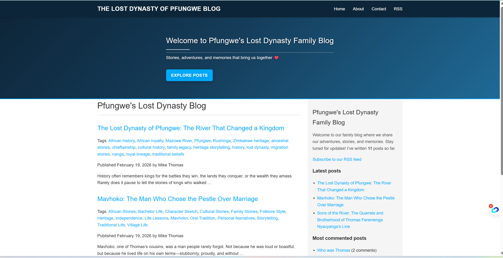
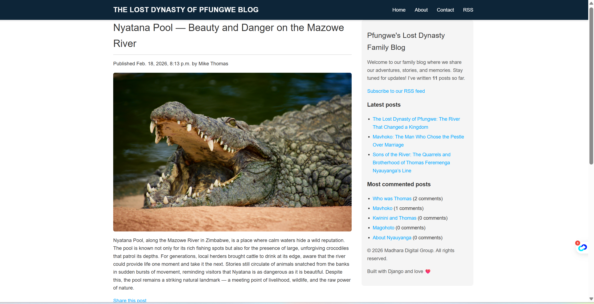

# Dynasty Blog — Production-Ready Django Blogging Platform

---

## 🚀 Live Demo

🌐 https://ndikiyefamily.com

---

## 📖 Overview

**Dynasty Blog** is a full-stack, production-deployed Django blogging platform built with scalability, security, and maintainability in mind.
It demonstrates real-world backend engineering practices including containerisation, reverse proxy deployment, database orchestration, and secure content moderation.

This project was built not just to function locally — but to run reliably in a real production environment.

---

## ✨ Features

* 📝 Create, edit, and publish posts with rich media
* 🖼 Image, audio, and video upload support
* 🏷 Tagging system for categorised browsing
* 💬 Comment system with admin moderation
* 🔐 Secure admin dashboard
* 📱 Fully responsive layout
* ⚡ Optimised static file delivery
* 🌍 Public production deployment with HTTPS
* 🐳 Dockerised services for reproducible environments
* 🧱 PostgreSQL production database

---

## 🛠 Tech Stack

**Backend**

* Django
* PostgreSQL
* Gunicorn

**Infrastructure**

* Docker
* Docker Compose
* Nginx reverse proxy
* Linux VPS deployment

**Frontend**

* Django Templates
* HTML5
* CSS3

---

## 📸 Application Preview

### Homepage



### Blog Post View




---

## ⚙️ Local Installation

Clone repo:

```bash
git clone https://github.com/Mikemupararano/dynasty-blog.git
cd dynasty-blog
```

Create virtual environment:

```bash
python -m venv venv
source venv/bin/activate
```

Install dependencies:

```bash
pip install -r requirements.txt
```

Run migrations:

```bash
python manage.py migrate
```

Create superuser:

```bash
python manage.py createsuperuser
```

Run server:

```bash
python manage.py runserver
```

---

## 🐳 Docker Production Deployment

Build + start containers:

```bash
docker compose -f docker-compose.prod.yml up -d --build
```

Run migrations inside container:

```bash
docker compose exec web python manage.py migrate
```

Collect static files:

```bash
docker compose exec web python manage.py collectstatic --noinput
```

---

## 🔐 Security Features

* Comments default to **inactive until approved**
* Media upload validation (size + file type)
* Secure HTTP headers configured in Nginx
* HTTPS enforced
* Admin panel protected
* Static/media caching headers
* Django production settings separation

---

## 📂 Project Structure

```
dynasty-blog/
│
├── blog/                # main app
├── dynasty_blog/        # settings + config
├── templates/           # HTML templates
├── staticfiles/         # collected static
├── media/               # uploaded media
├── docker-compose.prod.yml
├── Dockerfile
├── requirements.txt
└── manage.py
```

---

## 📊 Engineering Highlights

This project demonstrates real-world engineering competencies:

* Production deployment architecture
* Infrastructure debugging & log tracing
* Reverse proxy configuration
* Container lifecycle management
* Secure media serving
* Environment-based settings
* Database container orchestration
* Error tracing from logs to code
* Full request lifecycle understanding

---

## 🧠 Lessons Learned

During development and deployment:

* Debugged container boot failures
* Diagnosed Gunicorn worker crashes
* Fixed template rendering errors
* Resolved static/media serving issues
* Handled migration sync across environments
* Configured Nginx routing + headers

---

## 📌 Roadmap

Future improvements:

* Search functionality
* User accounts
* Post likes/reactions
* Email notifications
* REST API
* Caching layer (Redis)
* Background tasks (Celery)
* CDN integration

---

## 👨‍💻 Author

**Mike Thomas**

Full-Stack Developer
Python • Django • APIs • Systems Architecture • Deployment

---

## 📜 License

MIT License — free to use, modify, and distribute.

---

## ⭐ Why This Project Stands Out

Unlike tutorial projects, this system:

* runs in production
* is publicly accessible
* is containerised
* uses real infrastructure
* includes security layers
* demonstrates DevOps competency

It represents **real engineering capability**, not just coding ability.
